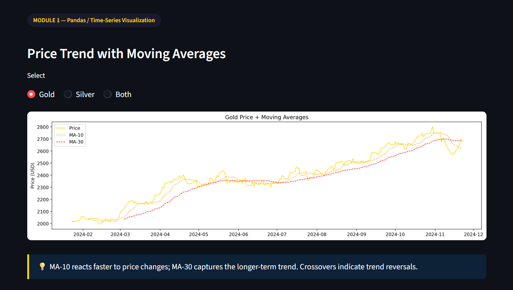
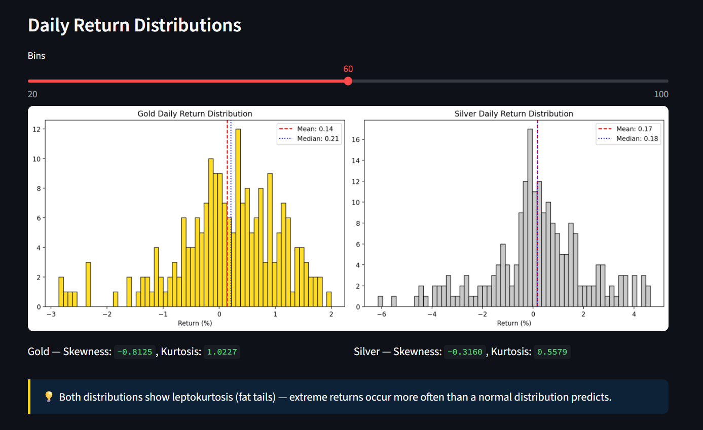
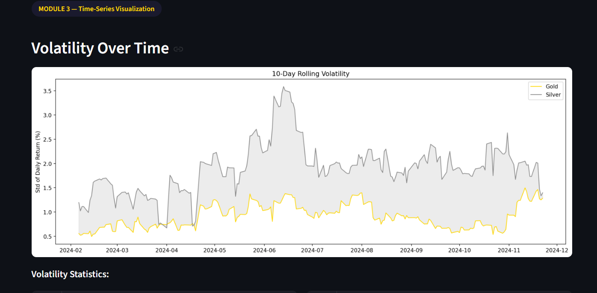
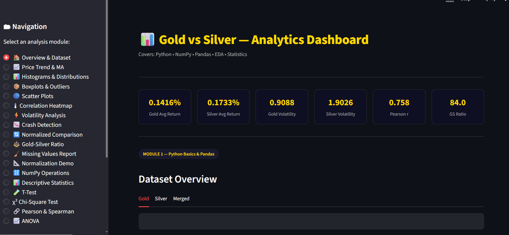

# Gold & Silver Price Analyzer

## 📊 Description
A data analysis project that explores trends, volatility, and relationships between gold and silver prices using Python.

## 🚀 Features
- Price trend visualization
- Histogram analysis
- Volatility comparison
- Correlation insights

## 🛠 Tech Stack
- Python
- Pandas
- NumPy
- Matplotlib

## 📈 Visualizations
### Price Trend

### Histogram

### Volatility Graph

### Dashboard

## 📂 Files
- `app.py` → main code
- `gold_data.csv`, `silver_data.csv` → datasets
- `requirements.txt` → dependencies

## 📌 Status
Completed as a data analysis project.
